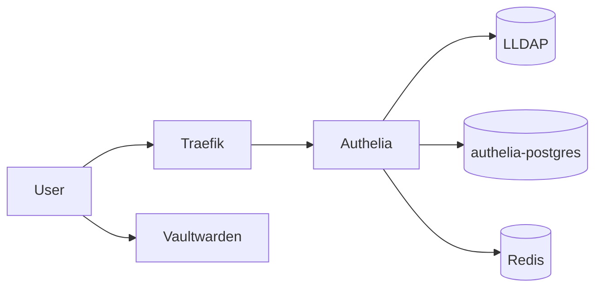

# Cerberus — Identity, SSO & Secrets

The gatekeeper stack for Yggdrasil. Authelia-powered SSO with LLDAP user directory and Vaultwarden password management. All services sit behind Traefik forward-auth middleware.



## Services

| Service | Role |
|---|---|
| Authelia | SSO identity provider with 2FA |
| LLDAP | Lightweight LDAP user directory |
| Vaultwarden | Bitwarden-compatible password manager |
| PostgreSQL | Persistent storage (preferences, OIDC tokens) |
| Redis | Session cache |

## Deploy

```
DOCKER_HOST=ssh://gaia docker stack deploy -c docker-compose.yml cerberus
```

CI/CD runs via GitHub Actions on a self-hosted runner.

## Documentation

Full architecture, backup strategy, volume layout, and OIDC client configuration: [Cerberus Stack](https://github.com/yggdrasil-lab/cerberus/blob/main/docs/Cerberus%20Stack.md) in the vault.
